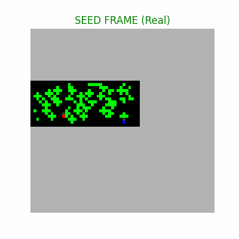

# Mini-Genie: Latent Action World Models 🧞‍♂️

A generative World Model that learns to play and simulate **MiniGrid** environments from pixels, without access to ground-truth actions. Inspired by the Google Genie paper, this implementation uses a causal transformer to discover latent physical actions and simulate future trajectories.

---

## 🧠 Architecture

The system consists of three main components designed for visual understanding and temporal reasoning:

1.  **The Eyes (VQ-VAE with EMA)**
    Compresses 64×64 game frames into a 16×16 grid of discrete tokens.
    -   **Improvement**: Uses **Exponential Moving Average (EMA)** and codebook resetting to prevent cluster collapse, resulting in significantly sharper and more stable reconstructions.
    -   **Loss Enhancement**: Combines MSE with **LPIPS (Perceptual Loss)** to preserve fine-grained details of the agent and environment.

2.  **The Brain (Sliding-Window Transformer)**
    Learns the world's dynamics by observing frame sequences.
    -   **Temporal Context**: Instead of simple transitions, the model now uses a **Context Window (W=4)**. This allows the transformer to understand velocity, direction, and long-term dependencies.
    -   **Latent Action Discovery**: An `ActionRecognitionNet` infers actions from state changes ($z_t, z_{t+1}$), and the dynamics model uses these discovered concepts to "dream" consistent futures.

3.  **The Dream (Autoregressive Generator)**
    Hallucinates future frames by sliding its temporal window forward. By feeding its own discrete predictions back into the transformer, the model can simulate long trajectories purely from imagination.

---

## 📊 Results

### 1. Latent Action Discovery
The model successfully clusters agent behaviors (turning, moving forward) into distinct latent categories using entropy regularization.


### 2. Dreaming the Future
Example of the agent “dreaming” a 50-frame trajectory. Note the temporal consistency achieved through the windowed context.



---

## 🚀 How to Run

### 1. Installation

```bash
conda create -n mini-genie python=3.10
conda activate mini-genie
pip install -r requirements.txt
pip install gym-minigrid
```

---

### 2. Full Training Pipeline

The project follows a staged training approach. You can run the entire pipeline with a single command:

```bash
bash scripts/fix_and_train.sh
```

This script performs the following:
1.  **Tokenization**: Converts raw pixel data into discrete VQ-VAE tokens.
2.  **Dynamics Training**: Trains the Transformer using windowed sequences.
3.  **Visualization**: Generates t-SNE plots and the "dream" GIF.

### 3. Manual Steps (Optional)

-   **Record Data**: `python src/record_active_data.py` (Default: 1000 episodes).
-   **Train Vision**: `python src/train_vqvae.py` (If you need to improve visual sharpness).
-   **Train Brain**: `python src/train_transformer_dynamics.py`.

---

## 📂 Project Structure

```text
mini-genie/
├── data/                  # Datasets and Artifacts (Ignored by git)
│   ├── episodes/          # Raw .npz game recordings
│   ├── tokens/            # Tokenized episodes (VQ-VAE output)
│   └── artifacts/         # Saved models (.pth), plots, and GIFs
├── src/
│   ├── record_active_data.py       # 1. Environment interaction & data collection
│   ├── train_vqvae.py              # 2. Visual Compressor (VQ-VAE + EMA)
│   ├── tokenize_data.py            # 3. Off-line data tokenization
│   ├── train_transformer_dynamics.py # 4. World Model (Windowed Transformer)
│   ├── visualize_tsne.py           # 5. Latent Action Analysis
│   └── generate_dream_gif.py       # 6. Autoregressive Simulation
└── scripts/               
    └── fix_and_train.sh            # Complete end-to-end pipeline
```

---

## 🛠 Advanced Configuration

In `src/train_transformer_dynamics.py`, you can tune the following:
-   `WINDOW_SIZE`: Number of frames the model "remembers".
-   `ENTROPY_WEIGHT`: Controls how "spread out" the discovered actions are.
-   `HIDDEN_DIM`: Main capacity of the world model transformer.

> [!NOTE]
> Training with 1000 episodes and 30 epochs is recommended for consistent physics discovery.